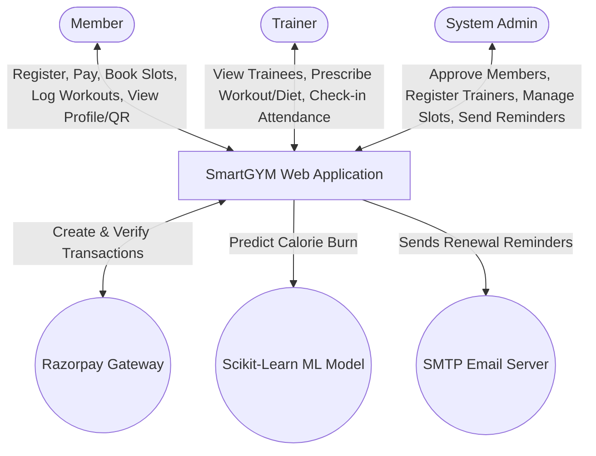
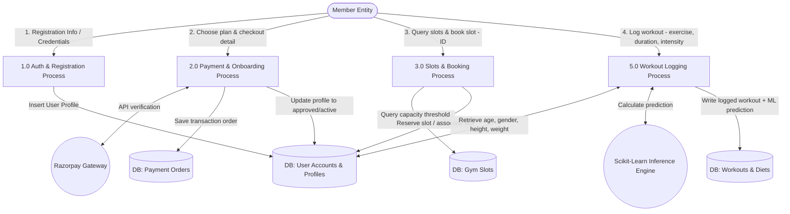
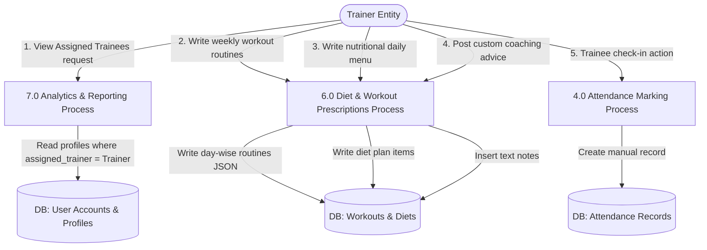
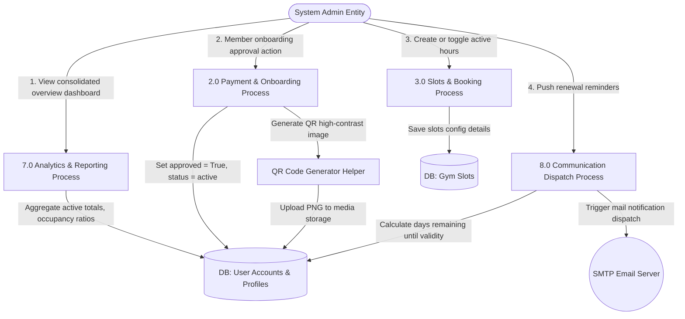
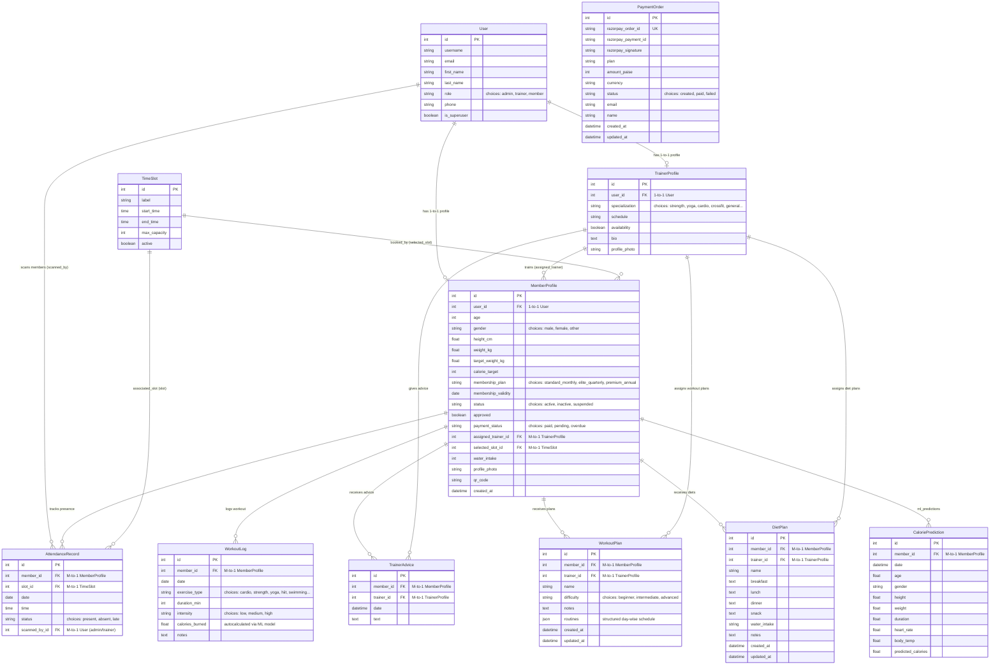

# SmartGYM — Complete Project Workflow, Architecture & Diagrams

Welcome to the technical workflow and architectural master file for **SmartGYM (Smart Gym Management System)**. This document serves as a comprehensive reference guide outlining how the React + TypeScript frontend, Django REST Framework backend, Machine Learning Calorie Prediction Model, and Razorpay payment integrations operate in harmony.

---

## Table of Contents
1. [System Architecture & High-Level Block Diagram](#1-system-architecture--high-level-block-diagram)
2. [Data Flow Diagrams (DFDs)](#2-data-flow-diagrams-dfds)
   - [Level 0: System Context Diagram](#level-0-system-context-diagram)
   - [Level 1: Core Functional Process Diagram](#level-1-core-functional-process-diagram)
3. [Entity-Relationship (ER) Diagram](#3-entity-relationship-er-diagram)
4. [Roles & Detailed User Workflows](#4-roles--detailed-user-workflows)
   - [Administrative Workflow](#administrative-workflow)
   - [Trainer Workflow](#trainer-workflow)
   - [Member Workflow](#member-workflow)
5. [Calorie Prediction Engine (ML Integration)](#5-calorie-prediction-engine-ml-integration)
6. [Razorpay Payment Processing Flow](#6-razorpay-payment-processing-flow)
7. [API Endpoint Directory](#7-api-endpoint-directory)

---

## 1. System Architecture & High-Level Block Diagram

SmartGYM is built upon a modern decoupled architectural stack designed for high throughput, real-time interactive dashboards, secure transactions, and predictive ML tracking:

```
                  ┌──────────────────────────────┐
                  │      React SPA Frontend      │
                  │   (Vite, TSX, React Router)  │
                  └──────────────┬───────────────┘
                                 │
                                 │ HTTP REST Requests
                                 │ (JSON + JWT Authorization Bearer)
                                 ▼
                  ┌──────────────────────────────┐
                  │      Django DRF Backend      │
                  │  (JWT Auth, Serializers, API)│
                  └──────────┬───┬───────────┬───┘
                             │   │           │
           ┌─────────────────┘   │           └─────────────────┐
           ▼                     ▼                             ▼
┌────────────────────┐ ┌────────────────────┐       ┌────────────────────┐
│   SQLite Database  │ │ Scikit-Learn Model │       │  Razorpay Checkout │
│ (Relational Data)  │ │ (joblib, pandas ML)│       │ (Payment Gateway)  │
└────────────────────┘ └────────────────────┘       └────────────────────┘
```

---

## 2. Data Flow Diagrams (DFDs)

### Level 0: System Context Diagram

The Level 0 context diagram models the main actors interacting with the central system, as well as external services like Razorpay, the SMTP Mail Server, and the AI Inference Engine:



---

### Level 1: Core Functional Process Diagram

The Level 1 diagram drills down into the core sub-processes of the application, representing how data travels from entities to specific API processors and gets written to storage:

```mermaid
graph TD
    %% Actors
    U([User])
    A([Admin])
    T([Trainer])
    M([Member])

    %% Database / Data Stores
    subgraph Data Stores [Database Storage]
        DB_User[(User Accounts & Profiles)]
        DB_Slots[(Gym Slots)]
        DB_Attendance[(Attendance Records)]
        DB_Workouts[(Workouts & Diets)]
        DB_Payments[(Payment Orders)]
    end

    %% Processes
    P1(1.0 Auth & Registration)
    P2(2.0 Payment & Onboarding)
    P3(3.0 Slots & Booking)
    P4(4.0 QR Attendance Scanner)
    P5(5.0 Workout Logging & ML Prediction)
    P6(6.0 Diet & Workout Prescriptions)
    P7(7.0 Analytics & Reporting)

    %% Flows
    U -->|Credentials / Register info| P1
    P1 -->|Read / Write User| DB_User
    P1 -->|Token response| U

    M -->|Initiate plan checkout| P2
    P2 -->|Verify via Razorpay| RazorpayGateway((Razorpay API))
    RazorpayGateway -->|Success Signature| P2
    P2 -->|Record payment| DB_Payments
    P2 -->|Update profile status| DB_User

    A -->|Manage schedules| P3
    M -->|Select active slot| P3
    P3 -->|Reserve slot / Capacity check| DB_Slots
    P3 -->|Link slot to member| DB_User

    M -->|Presents QR Code| P4
    T & A -->|Scans QR / Manual Mark| P4
    P4 -->|Create entry| DB_Attendance
    P4 -->|Check late entry | DB_Slots

    M -->|Logs exercise type & duration| P5
    P5 -->|Biometrics request| DB_User
    P5 -->|Send inputs to ML| MLEngine((Scikit-Learn Engine))
    MLEngine -->|Calculate Calories Burned| P5
    P5 -->|Write log| DB_Workouts

    T -->|Write workout plan / diet| P6
    P6 -->|Write structured routines| DB_Workouts
    M -->|View trainer prescriptions| P6

    A -->|Fetch dashboards| P7
    P7 -->|Aggregate stats| DB_User
    P7 -->|Query logs| DB_Workouts
    P7 -->|Calculate occupancy| DB_Slots
```



---

### Level 2: Entity-Specific Descriptive DFD Workflows

To understand exactly how data routes through individual user roles, this section decomposes the DFD by highlighting each entity's flow, their inputs, processes triggered, and data stores written.

#### 1. Member Entity DFD Workflow
The Member is the core client interacting with front-of-house registration, slot booking, dynamic workout tracking, and diet logs.



* **Step-by-Step Data Path**:
  1. **User Auth & Registration**:
     * **Input Data**: Username, email, password, phone, age, gender, height, and weight.
     * **Process Triggered**: `/api/auth/register/` (registers standard Django `User` and standard `MemberProfile`).
     * **Data Store Written**: Saved in `User` and `MemberProfile` tables with `approved = False`, `status = 'inactive'`, and `payment_status = 'pending'`.
  2. **Payment & Onboarding**:
     * **Input Data**: Chosen subscription tier (Standard Monthly, Elite Quarterly, Premium Annual) + payment gateway authorization.
     * **Process Triggered**: `/api/payments/create-order/` and `/api/payments/verify-payment/`.
     * **Data Store Written**: Inserts record inside the `PaymentOrder` table with `status = 'paid'`.
  3. **Gym Time Slot Reservation**:
     * **Input Data**: Preferred time slot ID.
     * **Process Triggered**: `/api/members/<id>/book-slot/`.
     * **Process Logic**: Validates that slot exists and `booked_members` occupancy count is less than `max_capacity`.
     * **Data Store Written**: Updates `selected_slot_id` in `MemberProfile`.
  4. **Workout Logging & ML Prediction**:
     * **Input Data**: Exercise type, session duration (minutes), notes, and intensity.
     * **Process Triggered**: `/api/workouts/` (triggers `perform_create` serializer pipeline).
     * **Process Logic**: Fetches member's age, gender, height, and weight. Automatically maps heart rate and body temperature based on intensity. Feeds these 7 features into the loaded Scikit-Learn `predict_calories` function.
     * **Data Store Written**: Saves a new record in `WorkoutLog` containing the predicted value in `calories_burned`.

---

#### 2. Trainer Entity DFD Workflow
The Trainer oversees assigned trainees, manages attendance grids, and issues workout routines and nutritional plans.



* **Step-by-Step Data Path**:
  1. **Retrieve Assigned Members list**:
     * **Input Action**: Access trainer dashboard trainees list view.
     * **Process Triggered**: `/api/trainers/my-trainees/` (filters member profiles where `assigned_trainer` foreign key matches active trainer user).
     * **Data Store Queried**: `MemberProfile` and `User` tables.
  2. **Prescribe Workout Routines**:
     * **Input Data**: Routine name, notes, difficulty choice (Beginner, Intermediate, Advanced), and `routines` array (mapping days of the week to lists of exercises, sets, reps).
     * **Process Triggered**: `/api/workouts/plans/`.
     * **Data Store Written**: Inserts details inside the `WorkoutPlan` table.
  3. **Prescribe Diet Plans**:
     * **Input Data**: Meal details for Breakfast, Lunch, Dinner, Snack, daily water intake targets.
     * **Process Triggered**: `/api/workouts/diets/`.
     * **Data Store Written**: Inserts details inside the `DietPlan` table.
  4. **Post Coaching Advice**:
     * **Input Data**: Custom advisory notes text.
     * **Process Triggered**: `/api/trainers/advice/` (posts direct advice).
     * **Data Store Written**: Inserts record inside the `TrainerAdvice` table.
  5. **Mark Trainee Attendance Manually**:
     * **Input Data**: Target member ID and check-in status (present, absent, late).
     * **Process Triggered**: `/api/attendance/manual/`.
     * **Data Store Written**: Inserts new record inside the `AttendanceRecord` table.

---

#### 3. System Admin Entity DFD Workflow
The Admin manages structural logistics (slots), approves accounts, monitors gym-wide metrics, and issues automated communications.



* **Step-by-Step Data Path**:
  1. **Consolidated Overview Dashboard**:
     * **Input Action**: Admin login and dashboard render.
     * **Process Triggered**: `/api/reports/stats/` (aggregates totals: members, checkins today, trainers, active counts, and avg calories).
     * **Data Store Queried**: Queries all data tables synchronously to output real-time counts.
  2. **Member Profile Approval & QR Dispatch**:
     * **Input Action**: Click approval on pending members list.
     * **Process Triggered**: `/api/members/<id>/approve/`.
     * **Process Logic**: Validates admin role, updates status to `'active'`, triggers thread-safe `generate_qr(member)` library (which uses the `qrcode` library to encode `"SMARTGYM|<user_id>|<username>|<membership_plan>"` into a PNG image).
     * **Data Store Written**: Updates `approved = True`, `status = 'active'`, `payment_status = 'paid'`, and updates `qr_code` media image field.
  3. **Gym hour Time Slots Administration**:
     * **Input Data**: Slot hour label, starting hour, ending hour, active status flag, and maximum capacity limit.
     * **Process Triggered**: `/api/slots/`.
     * **Data Store Written**: Inserts/Updates entries inside the `TimeSlot` table.
  4. **Dispatch Membership Renewal alerts**:
     * **Input Action**: Dispatches email alerts.
     * **Process Triggered**: `/api/members/<id>/send-reminder/`.
     * **Process Logic**: Reads member's membership validity date. Calculates remaining validity days: `(validity - today).days`. Prepares and triggers HTML/text reminder mail content.
     * **Output Action**: Triggers Django's mail routing framework to dispatch automated reminders via SMTP to the member's registered email address.

---

## 3. Entity-Relationship (ER) Diagram

The Relational Database model is represented using standard Django relational mapping constraints. The custom model inherits from `AbstractUser` and coordinates roles:



---

## 4. Roles & Detailed User Workflows

### Administrative Workflow

Admins oversee gym logistics, financials, user approvals, and operational staff.

```
[Register Admin (seed/CLI)] ──> [Access Portal Dashboard] ──> [Monitor Gym Metrics (Reports)]
                                            │
        ┌───────────────────────────────────┼──────────────────────────────────┐
        ▼                                   ▼                                  ▼
[Approve Member Accounts]       [Register / Manage Trainers]     [Define Gym Time Slots / Capacities]
(Updates payment_status='paid'  (Assign specialization & bio)    (Controls max capacity threshold)
 & status='active'; triggers
 QR code generation)
        │
        ▼
[Send Renewal Reminders] ──> (Calculates days_left & dispatches alert emails via SMTP)
```

1. **Dashboard Analytics**: Retrieves consolidated statistics from `/api/reports/stats/` representing active member registration counts, active trainers count, gym checkins today, and active slot capacity limits.
2. **Approve Member Onboarding**: Admin navigates to the **Members** section. Approving a member updates their Django Model `MemberProfile`: `approved = True`, `status = 'active'`, and `payment_status = 'paid'`.
3. **QR Generation Trigger**: Upon approval, a thread-safe helper `generate_qr(member)` triggers, creating a base-64 QR string encoded with `"SMARTGYM|<user_id>|<username>|<membership_plan>"`, rendering a high-contrast PNG file preserved in `media/qrcodes/`.
4. **Trainer Rosters**: Admin registers new trainers, defining their work schedules and specialized physical training fields.
5. **Time Slots Creation**: Admins configure hours (e.g., *Morning Slot: 06:00 AM - 08:00 AM*), bounding them with a `max_capacity` constraint to ensure structural limits aren't breached.
6. **Renewal Management**: Admins dispatch manual alerts from the console. This computes `days_left = validity - today` and sends out automated emails using Brevo/Django SMTP.

---

### Trainer Workflow

Trainers focus on trainee progress tracking, checking physical form, and prescribing personalized nutrition and workout plans.

```
[Login as Trainer] ──> [Dashboard: View Assigned Trainees]
                                 │
     ┌───────────────────────────┼───────────────────────────┐
     ▼                           ▼                           ▼
[Log Workout Actions]      [Create Customized Plans]    [Write Dietary Needs]
(Add workout details       (Routines stored as day     (Prescribe Breakfast,
 and notes)                 schedules in JSON fields)   Lunch, Dinner, Snacks)
     │                           │                           │
     └───────────────────────────┼───────────────────────────┘
                                 ▼
                     [Provide Direct Advice]
                     (Send quick messages)
                                 ▼
                     [Manual Member Check-in]
                     (Mark member status manually)
```

1. **Trainee Overview**: Fetching `/api/trainers/my-trainees/` returns all member profiles assigned to this trainer (assigned via Django foreign keys).
2. **Prescribe Workout Routines**: Trainer crafts day-by-day routines which are saved in the Django model `WorkoutPlan`'s `routines` JSON field (stores array objects representing days, exercises, sets, reps).
3. **Prescribe Nutrition (Diet Plan)**: Defines breakfast, lunch, dinner, snack, and daily water targets.
4. **Interactive Advice**: Direct advice can be written and posted directly to the trainee's page, registering a `TrainerAdvice` record.
5. **Mark Attendance**: Manually check-in a trainee on the **Attendance** sheet, recording their status as `present`, `absent`, or `late`.

---

### Member Workflow

Members are the core clients utilizing the gym facilities, tracking progress, and verifying check-ins.

```
[Register Online] ──> [Choose Tier / Checkout] ──> [Process Payment (Razorpay)]
                                                          │
          ┌───────────────────────────────────────────────┘
          ▼
[Profile Approved by Admin] ──> [View Dashboard & QR Code]
                                          │
       ┌──────────────────────────────────┼──────────────────────────────────┐
       ▼                                  ▼                                  ▼
[Select & Book Time Slot]       [Log Exercises & Workouts]      [Track Habits (Water / Diet)]
(Checks occupancy capacity;      (Invokes Scikit-Learn model     (Update daily water intake,
 books slot if not full)         to predict calories burned)     view assigned trainer diet)
```

1. **Sign Up & Account Creation**: Creates a standard user with the `member` role choice.
2. **Subscription Payment**: Triggers a payment checkout modal via Razorpay (either sandbox mockup or live gateway).
3. **Slot Reservation**: Members query open schedules. If `occupancy < max_capacity`, the slot is successfully reserved via `/api/members/<id>/book-slot/`.
4. **Check-in with QR**: Displays the system-generated QR code on the mobile dashboard. The trainer scans the QR code, hitting `/api/attendance/qr/`.
   - *Late entry check*: If check-in time exceeds 10:00 AM, the record status auto-saves as `'late'`, otherwise `'present'`.
5. **Workout Tracking**: Members log daily exercises. The backend intercepts this creation and calls the Scikit-Learn Calorie Engine to calculate exact energy expenditures automatically.
6. **Habit Tracking**: Members record water intake directly from the dashboard to ensure they remain hydrated.

---

## 5. Calorie Prediction Engine (ML Integration)

SmartGYM integrates an automated inference pipeline utilizing a Scikit-Learn predictive model. The engine computes calories burned using user biometric stats and specific workout variables.

### Machine Learning Data Pipeline
```
[User Log Input: Duration, Intensity] 
                  │
                  ▼
[Biometric Retrieval: Age, Gender, Height, Weight] ──> [DataFrame Assembly]
                                                              │
                                                              ▼
[Load Pre-trained Pipeline (joblib)] ──> [Calorie Prediction Model] ──> [Save WorkoutLog (calories_burned)]
```

### ML Inference Engine Details (`backend/predictor/engine.py`)
- **Pipeline Storage**: The pipeline is serialized inside a binary file loaded via `joblib.load(settings.ML_MODEL_PATH)`.
- **Model Architecture**: Uses a Scikit-Learn pipeline featuring scaling and a regression core (e.g., Random Forest or Gradient Boosting).
- **Features Extracted**:
  - `age` (Age in years)
  - `gender` (Lowercase: male / female / other)
  - `height` (Height in cm)
  - `weight` (Weight in kg)
  - `duration` (Exercise session length in minutes)
  - `heart_rate` (Estimated bpm derived from training intensity)
  - `body_temp` (Core temp in Celsius, estimated from intensity)

### Auto-Estimation of Cardiac & Thermal Inputs (`backend/workouts/views.py`)
When a member logs a workout without providing biometric hardware readings, cardiac and thermal properties are automatically mapped using the log's `intensity` level:
- **High Intensity**: `heart_rate = 145 bpm`, `body_temp = 38.3 °C`
- **Medium Intensity**: `heart_rate = 125 bpm`, `body_temp = 37.6 °C`
- **Low Intensity**: `heart_rate = 95 bpm`, `body_temp = 36.8 °C`

---

## 6. Razorpay Payment Processing Flow

SmartGYM features an integrated Razorpay checkout system, backed by a sandbox fallback mechanism to ensure seamless testing in development environments.

```
 [Frontend UI]             [Django Backend]             [Razorpay API]
       │                          │                            │
       │─── 1. Create Order ─────>│                            │
       │    (Plan details)        │─── 2. Initialize Order ───>│
       │                          │    (Amount, currency)      │
       │                          │<── 3. Return Order ID ─────│
       │<── 4. Setup Checkout ────│                            │
       │    (Order ID, key)       │                            │
       │                          │                            │
       │─── 5. Open Checkout Modal ───────────────────────────>│
       │<── 6. Execute Payment (User authorizes) ──────────────│
       │<── 7. Signature & IDs ────────────────────────────────│
       │                          │                            │
       │─── 8. Verify Payment ───>│                            │
       │    (IDs & Signature)     │─── 9. Validate Signature ──│
       │                          │    (HMAC-SHA256 compare)   │
       │<── 10. Success Response ─│                            │
```

### Checkout Flow Breakdown:
1. **Order Creation**: Frontend calls `/api/payments/create-order/` passing `plan` (Standard, Elite, or Premium).
2. **Razorpay Client Call**: Django reads `RAZORPAY_KEY_ID` & `RAZORPAY_KEY_SECRET`. It builds the request and initiates the order with Razorpay, receiving a unique `order_id`.
3. **Sandbox Fallback Mode**: If Razorpay credentials are missing or default settings are present, the system operates in **Mock Mode**, generating a mock order ID (`order_mock_<uuid>`) and setting `is_mock=True` to allow sandbox bypass.
4. **Verify Payment**: After authorization, Razorpay returns `razorpay_order_id`, `razorpay_payment_id`, and `razorpay_signature`. The frontend submits these to `/api/payments/verify-payment/`.
5. **HMAC-SHA256 Signature Verification**: The backend validates the payment's authenticity using SHA256 hashing:
   ```python
   expected = hmac.new(
       settings.RAZORPAY_KEY_SECRET.encode(),
       f"{razorpay_order_id}|{razorpay_payment_id}".encode(),
       hashlib.sha256
   ).hexdigest()
   ```
   If verified, the `PaymentOrder` model is updated to `status = 'paid'`, and the member's profile is approved.

---

## 7. API Endpoint Directory

Below is the structured API directory of the Django backend:

| Base URL Route | HTTP Method | Target Endpoint | Description | Auth Level Required |
| :--- | :---: | :--- | :--- | :---: |
| **`/api/auth/`** | `POST` | `/login/` | User authentication & JWT generation | Public |
| | `POST` | `/register/` | Member/Trainer Account registration | Public |
| | `GET` | `/me/` | Retrieves authenticated user profile | Authenticated |
| | `POST` | `/change-password/` | Updates active user's credentials | Authenticated |
| **`/api/members/`** | `GET` / `POST` | `/` | List profiles (filtered by role) or create | Authenticated |
| | `GET` / `PUT` | `/<id>/` | Fetch, edit, or delete profile details | Admin / Owner |
| | `GET` | `/me/` | Fast shortcut for current user's profile | Authenticated |
| | `PATCH` | `/<id>/approve/` | Admin approval & active status update | Admin |
| | `PATCH` | `/<id>/book-slot/` | Selects gym time slot for member | Member / Admin |
| | `PATCH` | `/<id>/upload-photo/`| Uploads avatar to server storage | Owner / Admin |
| | `PATCH` | `/<id>/water/` | Updates daily water intake metrics | Member |
| | `POST` | `/<id>/send-reminder/`| Dispatches renewal notification email | Admin |
| **`/api/trainers/`**| `GET` | `/` | List all registered trainers | Authenticated |
| | `GET` | `/my-trainees/` | Retrieve members assigned to the trainer | Trainer |
| | `POST` | `/advice/` | Write training guidance/messages | Trainer |
| **`/api/attendance/`**| `GET` | `/` | Review historical check-in records | Authenticated |
| | `POST` | `/qr/` | Scanner checkout: processes QR scan checks | Trainer / Admin |
| | `POST` | `/manual/` | Directly checks in a gym member | Trainer / Admin |
| **`/api/workouts/`**| `GET` / `POST` | `/` | List history or log a new workout | Authenticated |
| | `GET` / `POST` | `/plans/` | List/create structured workout routines | Authenticated |
| | `GET` / `POST` | `/diets/` | List/create dietary prescriptions | Authenticated |
| **`/api/payments/`**| `POST` | `/create-order/` | Initializes online subscription checkout | Public |
| | `POST` | `/verify-payment/` | Verifies secure gateway transaction signature| Public |
| **`/api/predictor/`**| `POST` | `/predict/` | Process ML prediction on input metrics | Authenticated |
| | `GET` | `/history/` | Fetch historical calorie calculations | Authenticated |
| **`/api/reports/`**  | `GET` | `/stats/` | Retrieves core dashboard analytics counts | Authenticated |
| | `GET` | `/weekly-checkins/`| 7-day attendance timeline tracking | Authenticated |
| | `GET` | `/calorie-trends/` | Progression graph points of calorie predictions| Authenticated |

---

## 8. Summary of core frontend routing integration (`frontend/src/app/App.tsx`)

Redirection logic is cleanly segmented by user roles inside a wrapper:
- **Guest / Public Routes**:
  - `/` — Premium high-conversion animated marketing landing page (`Landing.tsx`).
  - `/login` — Form validation page checking credentials for account access (`Login.tsx`).
- **Dashboard Hub Portal Layout (`/portal`)**:
  - `overview` — Dynamically switches user components based on active role (`Overview.tsx`).
  - `scanner` — Dedicated QR scanner component using mobile camera capture (`QRScanner.tsx`).
  - `predictor` — Scikit-learn Biometrics-driven Calorie Estimator dashboard (`MLPredictor.tsx`).
  - `reports` — Charts tracking calorie expenditure, slot metrics, and attendance (`Reports.tsx`).
- **Admin Dashboards**:
  - `/portal/members` — Member list for verification, updates, and assigning trainers.
  - `/portal/trainers` — Specialized staff profiles management screen.
  - `/portal/slots` — Gym hour scheduling panel.
- **Trainer Dashboards**:
  - `/portal/trainees` — Trainee plans setup and advice center.
  - `/portal/attendance` — Standard manual check-in roster.
- **Member Dashboards**:
  - `/portal/profile` — Digital profile rendering membership parameters and high-contrast check-in QR code.
  - `/portal/workouts` — Interactive workout logger with inline AI calorie burn metrics.
  - `/portal/diet` — Meal plans prescribed by the member's assigned trainer.

---

*This concludes the complete analysis. SmartGYM stands as a fully secure, performant, and intelligent gym management workspace ready for enterprise scale.*
